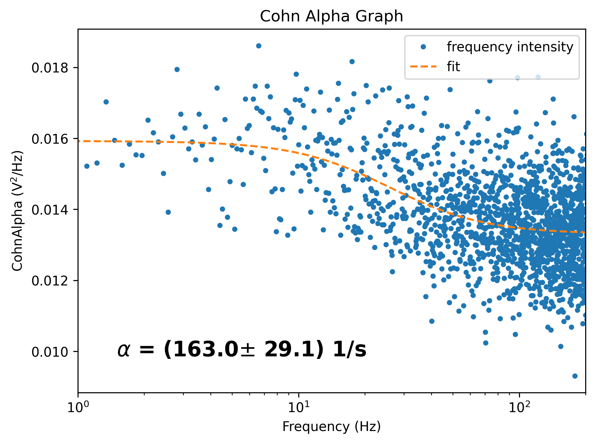

# Cohn Alpha Method

This section of the PyNoise suite is for Cohn Alpha (aka Power Spectral Density) Algorithm analysis. If you are unfamiliar with the Power Spectral Density method, please familiarize yourself before using this package and reading the README file.


### Requirements

Besides those mentioned in the main README file, the following programs must be downloaded to run Power Spectral Density analysis:
* CohnAlpha.py
* CohnAlphaDriver.py

Required python libraries (can be automated with requirements.txt from the main README.md):  
* NumPy   
* Matplotlib   
* Scipy

Additionally, you will need the following:
* A single file of data that will be analyzed.
* A settings configuration file (see the settings section for more information).


### I/O FILE INFO

The format of the file you want to analyze should be a .txt file with a list of inputs separated by new lines.


### Settings Configurations

The CohnAlpha program can be run with a variety of options that change the visual output and type of analysis being run. In the settings file, this is listed as the PSD Settings. The settings are as follows: 
* Dwell time (*float*): Description  (TODO).
* Meas time range (*list of type float (size=2)*): The meas time range set by two float values in a list that denotes start and end.
* Clean pulses switch (*float*): Description  (TODO).


### Driver
```CohnAlphaDriver.py``` is used to run all analysis pertaining to the Power Spectral Density method, and is called from the main driver. **Trying to call psdDriver independently will not work**. 
There are 2 options for this method:  
* m - run the entire program through the [main driver](#main)
* s - view or edit the program [settings](#settings-configurations)
* Leave the command blank to end the program.


### Editor
The editor class for modifying settings is also accessible from the CohnAlphaDriver. See the main README file for more information on its proper use.


### CohnAlpha.py

CohnAlpha.py will have the following functions:
* CAFit()
* class CohnAlpha: __init__()
* class CohnAlpha: conductCohnAlpha()

The CAFit() function represents the Cohn Alpha Fitting Function

The class PowerSpectralDensity: __init__() function will initialize a CohnAlpha object
Inputs:
* list_data_array, 
* clean_pulses_switch (default=True, meaning that this paramter is turned on by default)
* dwell_time (default=2.0e6, meaning that the default value is 2,000,000)
* meas_time_range (default=[1.5e11, 1.0e12], meaning that the default range is [1.5e11, 1.0e12])

The class CohnAlpha: conductCohnAlpha() will perform the Cohn Alpha Analysis and produce the corresponding figures
Inputs:
* show_plot (default=True, meaning that showing the plot(s) is the default)
* save_fig (default=True, meaning that saving the plots(s) is the default)
* save_dir (default'./', meaning that the root directory of the repository is where it will be saved as a default) 
* leg_label (default="stilbene east", TODO)
* annotate_font_weight (default="bold", meaning that the annotation parameter will be bolded as a default)
* annotate_color (default="black", meaning that the annotation parameter will be the color black as a default)
* annotate_background_color (default="white", meaning that the annotation parameter will have a white background color as a default)

Outputs:
* f (TODO-description)
* Pxx (TODO-description)
* popt (TODO-description)
* pcov (TODO-description)

Running through all power spectral density analyses will produce an image that is similar to the following: 

