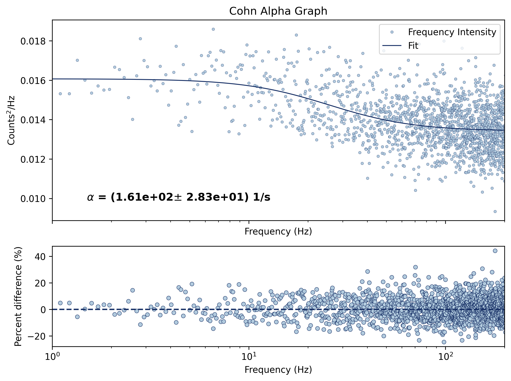
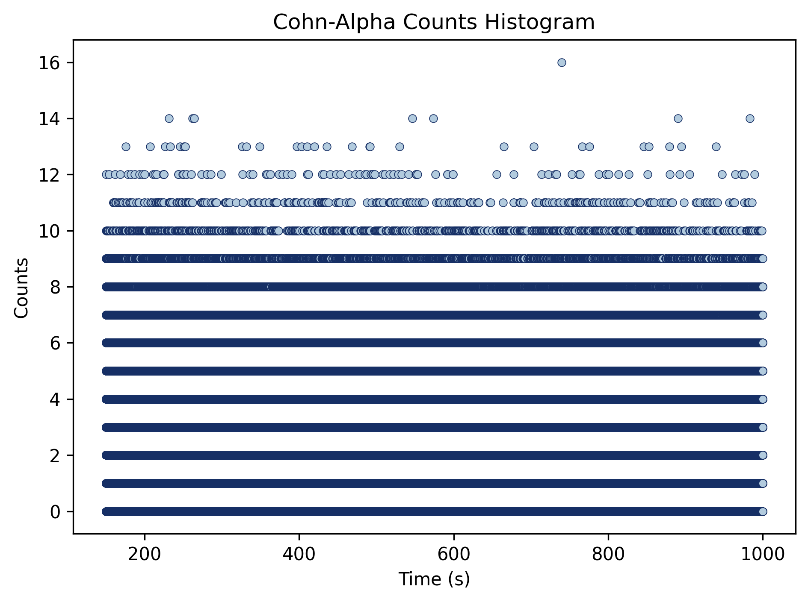

# Cohn Alpha Method

This section of the PyNoise suite is for Cohn Alpha (aka Power Spectral Density) Algorithm analysis. If you are unfamiliar with the Power Spectral Density method, please familiarize yourself before using this package and reading the README file.


### **Requirements**
Required python libraries (can be automated with requirements.txt from the main README.md):  
* NumPy   
* Matplotlib   
* Scipy

Additionally, you will need the following:
* A single file of data that will be analyzed.
* A settings configuration file (see the settings section for more information).


### **I/O FILE INFO**

The format of the file you want to analyze should be a .txt file with a list of inputs separated by new lines. Sample data inputs can be found with this link: [Google Drive - Sample Data](https://drive.google.com/drive/folders/1jEswA6AqeNLgGJW6iXs1Ti7XEXad9D0w)


### **Settings**
The CohnAlpha program can be run with a variety of options that change the visual output and type of analysis being run. In the settings file, this is listed as the CohnAlpha Settings. 

"Input/Output Settings": 
* "Input file/folder" (*str): Input data pathway.

"General Settings":
* "Show plots": Boolean setting controlling whether you want to show plots.

"CohnAlpha Settings":
* "Dwell time": This is the timing gate to record counts and the fluctuation between "dwells" are used to derive the distribution.
* "Meas time range": The measurement time range set by two float values in a list that denotes start and end.
* "Plot Counts Histogram": Boolean setting controlling whether you want to plot the Cohn Alpha counts histogram.
* The rest of the settings are the visual settings that can be adjusted.

"Scatter Plot Settings"
* These are the visual settings that can be adjusted.

A .json snippet example is shown below. You can reference the matplotlib website to check out available setting options here: [Maplotlib Website](https://matplotlib.org/stable/api/pyplot_summary.html)

```python
"Input/Output Settings": {
        "Input file/folder": INSERT INPUT PATHWAY HERE,
        "Time column": 0,
        "Channels column": null,
        "Save directory": "./data",
        "Save figures": false,
        "Save raw data": false,
        "Keep logs": false,
        "Quiet mode": false
    },

"General Settings": {
    "Number of folders": null,
    "Verbose iterations": false,
    "Sort data": true,
    "Show plots": true
},

"CohnAlpha Settings": {
        "Dwell time": 2000000.0,
        "Meas time range": [
            150000000000.0,
            1000000000000.0
        ],
        "Plot Counts Histogram": true,
        "Font Size": 12,
        "Annotation Font Weight": "bold",
        "Annotation Color": "black",
        "Annotation Background Color": "white",
        "nperseg": 4096

"Scatter Plot Settings": {
        "color": "#B2CBDE",
        "edgecolor": "#162F65",
        "linewidth": 0.4,
        "marker": "o",
        "s": 20
    }
},
```


### **CohnAlpha.py**
CohnAlpha.py will have the following functions:
* CAFit(): Represents the Cohn Alpha fitting function
* class CohnAlpha: __init__(): Constructs a Cohn Alpha object
* class CohnAlpha: conductCohnAlpha(): Performs the analysis


### **Driver**
```CohnAlphaDriver.py``` is used to run all analysis pertaining to the Power Spectral Density method, and is called from the main driver. **Trying to call psdDriver independently will not work**. 
There are 2 options for this method:  
* m - run the entire program through the [main driver](#main)
* s - view or edit the program [settings](#settings-configurations)
* Leave the command blank to end the program.


### **Editor**
The editor class for modifying settings is also accessible from the CohnAlphaDriver. See the main README file for more information on its proper use.


### **Output**
- A figure where the top half represents the Cohn Alpha distribution and bottom half represents the corresponding residuals
- A figure that represents the Cohn Alpha Counts Histogram plot





