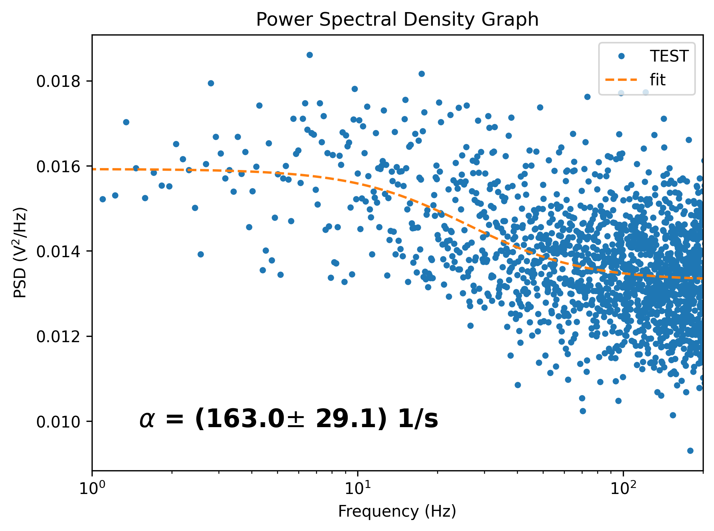

# Power Spectral Density

This section of the PyNoise suite is for Power Spectral Density Algorithm analysis. If you are unfamiliar with the Power Spectral Density method, please familiarize yourself before using this package and reading the README file.


### Requirements

Besides those mentioned in the main README file, the following programs must be downloaded to run RossiAlpha analysis:
* PSD.py
* psdDriver.py

Required python libraries:  
* numpy   
* matplotlib   
* scipy

Additionally, you will need the following:
* A single file of data that will be analyzed.
* A settings configuration file (see the settings section for more information).


### I/O FILE INFO

The format of the file you want to analyze should be a .txt file with a list of inputs separated by new lines.


### Settings Configurations

The PowerSpectralDensity program can be run with a variety of options that change the visual output and type of analysis being run. In the settings file, this is listed as the PSD Settings. The settings are as follows: 
* Dwell time (*float*): Description  (TODO).
* Meas time range (*list of type float (size=2)*): The meas time range set by two float values in a list that denotes start and end.
* Clean pulses switch (*float*): Description  (TODO).


### Driver
```psdDriver.py``` is used to run all analysis pertaining to the Power Spectral Density method, and is called from the main driver. **Trying to call psdDriver independently will not work**. 
There are 2 options for this method:  
* m - run the entire program through the [main driver](#main)
* s - view or edit the program [settings](#settings-configurations)
* Leave the command blank to end the program.


### Editor
The editor class for modifying settings is also accessible from the psdDriver. See the main README file for more information on its proper use.


### PSD.py

Running through all power spectral density analyses will produce an image that is similar to the following: 



