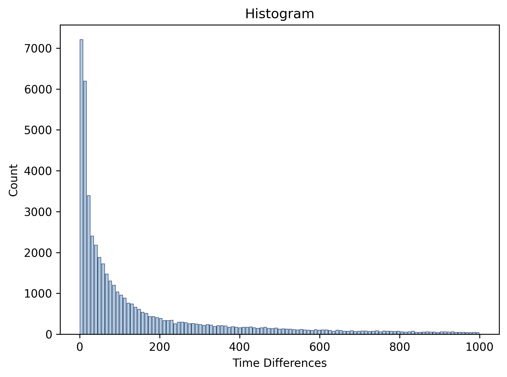
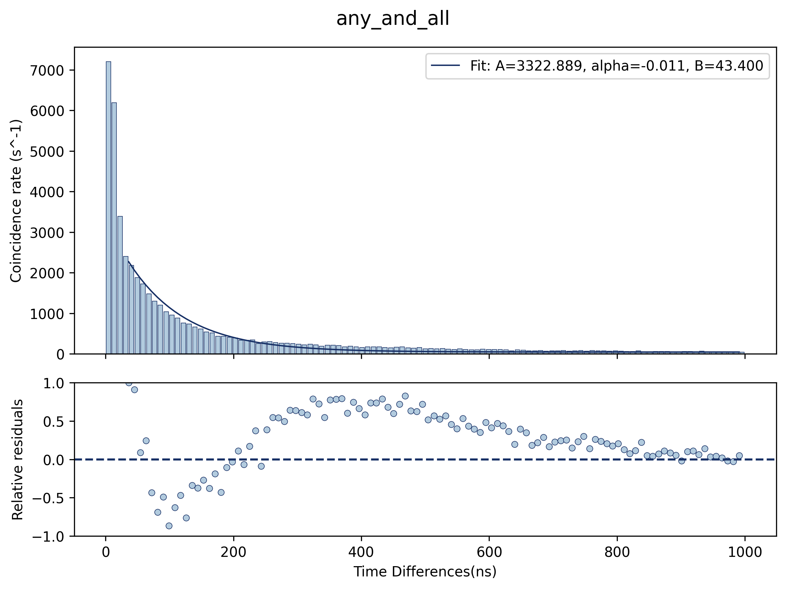

## Deprecated Documentation
Python package not supported yet, intended for future work.

### analyzeALL
```analyzeAll.py``` contains two functions, one for file type 1 and one for file type 2. ```analyzeAllType1(settings)``` calculates the time differences of a type 1 file, constructs a histogram, and fits a curve to the histogram, and constructs a residuals plot. It uses the settings dictionary to do these functions.   
```analyzeAllType2(settings)``` calculates the time differences for the file within each folder, constructs a histogram, fits a curve to each histogram, then constructs a scatterplot of all of the combined data and fits a curve to it

### Time Difference Calculator
```timeDifs.py``` contains a class, ```TimeDifsCalcs``` that can be initialized with the time data (a list of sorted detection times), the reset time, the method that we will be using, the digital delay, and the corresponding channels to the time data (if not using any_and_all method).

**Using Time Difference Calculator**
```python
from RossiAlpha.timeDifs import * #imports all classes from file
thisTimeDifCalc = timeDifCalcs(list_data, 2e3, any_and_all) #constructs an object called thisTimeDifCalc with a reset time of 2000 and method = any_and_all
time_diffs = thisTimeDifCalc.calculate_time_differences() #saves the array of time diffs as time_diffs
```

### RossiHistogram
In the plots.py file, there is a class called ```RossiHistogram``` which is a class that bins the data. There is one function under ```RossiHistogram``` called ```plot(self, time_diffs, save_every_fig, show_plot)```, in which the input parameter time_diffs is an array of time differences generated from the ```timeDifCalcs``` class.

**Using RossiHistogram**
```python
from RossiAlpha.plots import * #imports all classes from file
thisPlot = RossiHistogram(time_diffs, bin_width = 9, reset_time = 1300)
#construct a RossiHistogram object the time_diffs, the bin_width, and reset_time

counts, bin_centers, bin_edges = thisPlot.plot(save_fig=True, show_plot=True, save_dir = './path/to/savedir', plot_opts = settings['Histogram Visual Settings'])
#constructs the histogram and saves it to the given save_dir, shows it, and uses the plot options
#If you dont have a dictionary constructed of 
#Returns the counts,bin_centers, and bin_edges for later use
```



### Fitting
In the fitting.py file, there are two classes. One is called ```RossiHistogramFit``` and the other one is called ```Fit_With_Weighting```. The difference between the two classes is that "Fit_With_Weighting" deals with input type 1, as well as creating uncertainty plots. In ```RossiHistogramFit``` there are two functions called "fit()" and "fit_and_residual()", the former is used to fit an exponential decay curve onto the histogram and the latter produces a residual plot on top of the curve fitting.

fit_and_residual() function will do the same thing as Fit.fit(), execept that it will plot the relative residuals onto a plot right below the curve fitting plot. Thus, the images produced will have two plots that correspond to a line fitted for a histogram and a residua plot describing how well the line is fitting at each Time Difference (ns) unit. 

**Using Fitting**


```python
thisFit = RossiHistogramFit(counts, bin_centers, min_cutoff = 30, timeDifMethod = 'any_and_all', fit_range = [0,3000])
#construct the fit object
# Fitting curve to the histogram and plotting the residuals
#saves the plot with a fit on top and residuals on bottom but does not show it
thisFit.fit_and_residual(save_fig = True, save_dir = './path/to/save/dir', show_plot = False,fitting_opts= fitting_opts, residual_opts = residual_opts, hist_visual_opts = hist_visual_settings)
```



```python
RA_hist_total = analyzingFolders.compile_sample_stdev_RA_dist(settings)
from fitting import Fit_With_Weighting
thisWeightedFit = Fit_With_Weighting(RA_hist_total,min_cutoff = , general_settings,saveDir, fitting_opts, residual_opts)
#creates the fit to the data 
thisWeightedFit.fit_RA_hist_weighting()
#plots the histogram
thisWeightedFit.plot_RA_and_fit(save_fig= False, show_plot=True)

```
