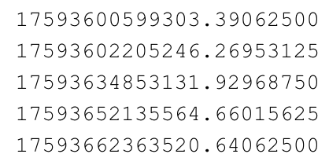

# RossiAlpha

This section of the PyNoise suite is for Rossi Alpha Algorithm analysis. This draws inspiration from faust lmx on gitlab.lanl.gov. This suite is designed specifically for pulse time-of-detection chains from organic scintillator arrays. If you are unfamiliar with the Rossi Alpha method, please familiarize yourself before using this package and reading the README file. Some resources on the Rossi Alpha method can be found below:


* [Rossi-Alpha Method](https://www.osti.gov/biblio/6188965)
* [Prompt Neutron Periods (Inverse Alpha)](https://doi.org/10.13182/NSE57-A25409)
* [Validation of Two-Region Rossi-Alpha](https://doi.org/10.1016/j.nima.2020.164535)

### Requirements

You will need the following inputs for the analysis:
* A single file or folder of data that will be analyzed.
* A settings configuration file (see the settings section for more information).

### I/O FILE INFO

The format of the file you want to analyze should be a .txt file with a list of time stamps of neutron detection times, separated by new lines. For folder analysis, the given folder should contain numbered folders that each contain data for analysis. A snippet of the sample data is shown below.



### How To Run RossiAlpha
* Create a .json file with the appropriate settings (default.json contains all the default settings)
* Input the pathway of your input data directory into the "Input file/folder" setting under "Input/Output Settings" in the .json file that you created (as shown in the .json snippet below)
```python
"Input/Output Settings": {
        "Input file/folder": INSERT PATHWAY HERE,
        "Time column": 0,
        "Channels column": null,
        "Save directory": "./data",
        "Save figures": false,
        "Save raw data": false,
        "Keep logs": false,
        "Quiet mode": false
    },
```
* Open your terminal and navigate to the PyNoise directory
* Type "python3 main.py" and hit enter (You should be prompted with a welcome message as shown below)
```
Welcome to the DNNG/PyNoise project.
With this software we are taking radiation data from fission reactions (recorded by organic scintillators) and analyzing it using various methods and tools.
Use this Python suite to analyze a single file or multiple across numerous folders.

Would you like to use the default settings or import another .json file?
d - use default settings
i - import custom settings
Select settings choice:
```
* Type "d" if you want to use the default settings or type "i" if you want to import the .json that created earlier
* If you are using the default settings, type "r" to run the RossiAlpha analysis
* If you are using the .json file from earlier, type "o" to run the RossiAlpha analysis
* The results should either pop up on the screen, saved to a folder, or both.

### Settings Configurations

The RossiAlpha program can be run with a variety of options that change the visual output and type of analysis being run. In the settings file, this is listed as the RossiAlpha Settings. The settings are as follows: 
* Time difference method (*string*): This refers to the way you want the time differences generated. the options are:  
    * any_and_all: Considers all time differences within the reset time.
    * any_and_all cross_correlations: Considers all time differences except those from the same detector.
    * any_and_all cross_correlations no_repeat: Considers all time differences except those from the same channel and doesn't consider more than one detection from each detector within the same reset period.
    * any_and_all cross_correlations no_repeat digital_delay: Considers all time differences except those from the same channel and doesn't consider more than one detection from each detector within the same reset period and adds a digital delay when considering detections from the same detector within the same reset period.
    * **NOTE: the last three options are only valid for folder analysis. For single file analysis, any_and_all must be chosen.**
* digital delay (*int*): The amount of digital delay, if applicable (see above).
* **Histogram Generation Settings**: Settings specific to generating RossiAlpha histograms:
    * Reset time (*int*): The maximum time difference recorded.
    * Bin width (*int*): The width of the histogram bins.
    * Error bar/band (*string*): For folder analysis, the type of visual used to show residuals of the overall line of best fit. Valid values are bar, band, and none.
* **Fit Region Settings**: Settings specific to applying the line of best fit to Rossi Alpha histograms:
    * Minimum cutoff (*int*): The value at which to start applying the line fitting algorithm.


### Running the RossiAlpha Method from the Main Driver
<figure class="video_container">
 <video controls="true" allowfullscreen="true" style = "width: 500px;">
 <source src="./RossiAlphaDemo.mp4" type="video/mp4" >
 </video>
</figure>

### Driver
```raDriver.py``` is used to run all analysis pertaining to the Rossi Alpha method, and is called from the main driver. **Trying to call raDriver independently will not work**. The driver has been designed modularly, so that analysis at any stage can be done without having to run through the entire process. There are 5 main options:
* m - run the entire program through the [main driver](#main)
* t - calculate [time differences](#time-difference-calculator)
* p - create [plots](#rossihistogram) of the time difference data
* f - [fit](#fitting) the data to an exponential curve
* s - view or edit the program [settings](#settings-configurations)
* Leave the command blank to end the program.